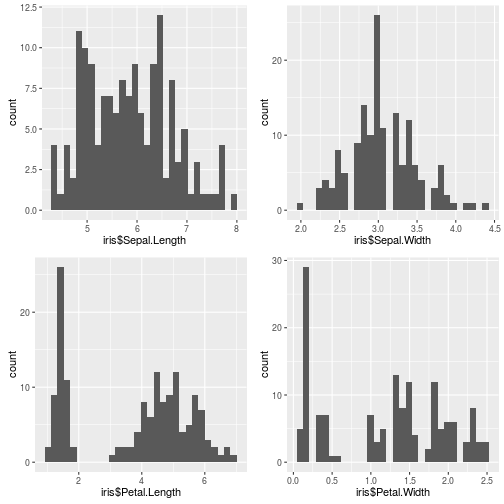

## Iris Data

1. One Species
2. Three Genus
3. One or three distributions for each numeric variable?

The observations by each species:


```
## 
##     setosa versicolor  virginica 
##         50         50         50
```

How many distributions?

---

## How many distributions?



---

<div class="row-fluid">
  <div class="container-fluid">
    <h2>Iris Data: Some Exploratory Plots</h2>
    <div class="row">
      <div class="col-sm-4">
        <form class="well">
          <div class="form-group shiny-input-container">
            <label class="control-label" for="plotType">Plot Type</label>
            <div>
              <select id="plotType"><option value="Scatter Plot" selected>Scatter</option>
<option value="Histogram">Histogram</option></select>
              <script type="application/json" data-for="plotType" data-nonempty="">{}</script>
            </div>
          </div>
          <div data-display-if="input.plotType == &#39;Scatter Plot&#39;">
            <div class="form-group shiny-input-container">
              <label class="control-label" for="x_var">X Variable</label>
              <div>
                <select id="x_var"><option value="Sepal.Length" selected>Sepal.Length</option>
<option value="Sepal.Width">Sepal.Width</option>
<option value="Petal.Length">Petal.Length</option>
<option value="Petal.Width">Petal.Width</option>
<option value="Species">Species</option></select>
                <script type="application/json" data-for="x_var" data-nonempty="">{}</script>
              </div>
            </div>
            <div class="form-group shiny-input-container">
              <label class="control-label" for="y_var">Y Variable</label>
              <div>
                <select id="y_var"><option value="Sepal.Length">Sepal.Length</option>
<option value="Sepal.Width">Sepal.Width</option>
<option value="Petal.Length" selected>Petal.Length</option>
<option value="Petal.Width">Petal.Width</option>
<option value="Species">Species</option></select>
                <script type="application/json" data-for="y_var" data-nonempty="">{}</script>
              </div>
            </div>
          </div>
          <div data-display-if="input.plotType == &#39;Histogram&#39;">
            <div class="form-group shiny-input-container">
              <label class="control-label" for="bins">Number of bins:</label>
              <input class="js-range-slider" id="bins" data-min="5" data-max="60" data-from="35" data-step="1" data-grid="true" data-grid-num="9.16666666666667" data-grid-snap="false" data-prettify-separator="," data-keyboard="true" data-keyboard-step="1.81818181818182" data-drag-interval="true" data-data-type="number"/>
            </div>
            <div class="form-group shiny-input-container">
              <label class="control-label" for="x_hist">Variable</label>
              <div>
                <select id="x_hist"><option value="Sepal.Length" selected>Sepal.Length</option>
<option value="Sepal.Width">Sepal.Width</option>
<option value="Petal.Length">Petal.Length</option>
<option value="Petal.Width">Petal.Width</option>
<option value="Species">Species</option></select>
                <script type="application/json" data-for="x_hist" data-nonempty="">{}</script>
              </div>
            </div>
          </div>
        </form>
      </div>
      <div class="col-sm-8">
        <div id="main_plot" class="shiny-plot-output" style="width: 100% ; height: 400px"></div>
      </div>
    </div>
  </div>
</div>

Some error at integration between Shiny and Slidify; the same alone shiny app works well.
